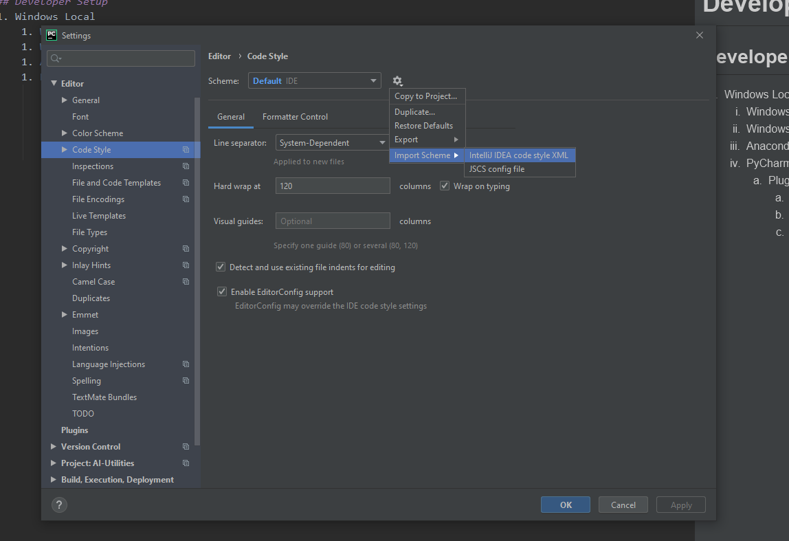

# Development Readme

## Developer Setup
1. Windows Local
    1. Windows 10
    1. Windows Subsystem for Linux
    1. Anaconda
    1. PyCharm
        1. Plugins
            1. Pylint
            1. SonarLint
            1. PUTVTs
        1. Configurations
            1. Code Style
            
            
            
### PyCharm Configuration

#### Code Style
Import code style which matches pylint/autopep8 from `.developer/pycharm_code_style.xml`

#### Inspections
This will offer to automatically fix common issues with code. 
Import code style which matches pylint/autopep8 from `.developer/pycharm_inspections.xml`)
